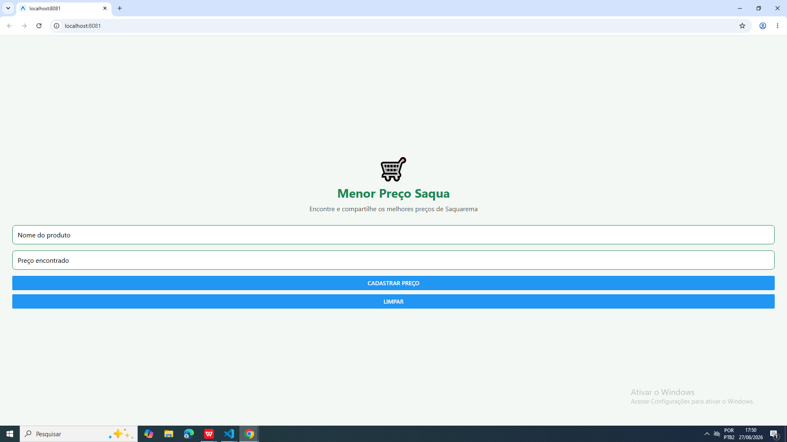
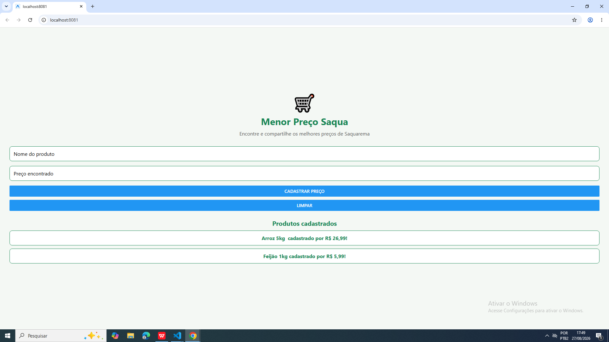
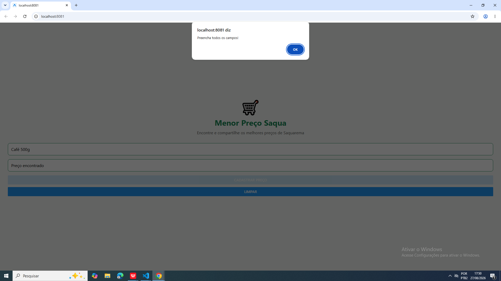

## Menor Preço Saqua 
Aplicativo híbrido desenvolvido na disciplina de Laboratório de Desenvolvimento de Aplicativos Híbridos.

## Problema
Em Saquarema existem diversos mercados com preços competitivos e promoções diferentes. Muitas vezes o consumidor precisa procurar em vários estabelecimentos para descobrir onde um determinado produto está mais barato.

## Proposta
O Menor Preço Saqua busca facilitar a consulta e o compartilhamento de preços e promoções dos mercados de Saquarema, auxiliando os consumidores na busca por opções mais econômicas.

## Objetivo 
Desenvolver um aplicativo híbrido que auxilie consumidores a localizar e compartilhar os menores preços encontrados nos mercados de Saquarema.

## Público-alvo
Moradores e consumidores de Saquarema que desejam economizar nas compras realizadas em supermercados da região de Saquarema.

## Funcionalidade desenvolvida
No primeiro MVP o usuário pode:
- Informar o nome de um produto;
- Informar o preço encontrado;
- Cadastrar o produto e o preço do produto;
- Cadastrar vários produtos;
- Visualizar na tela a lista de produtos cadastrados e seus preços;
- Limpar os campos após cada cadastro;
- Limpar a lista de produtos cadastrados;
- Receber uma mensagem de alerta caso tente cadastrar um produto sem preencher todos os campos.

## Tecnologias
- React Native
- TypeScript
- Expo
- Git
- GitHub 

## Integrantes
- Heloísa Alice
- Rafael Farias
- Paulo Sérgio
- Leonardo Velloso 

## Status
Projeto em desenvolvimento.

## Print da aplicação
Tela Inicial:

Produtos Cadastrados

Tela de Erro

